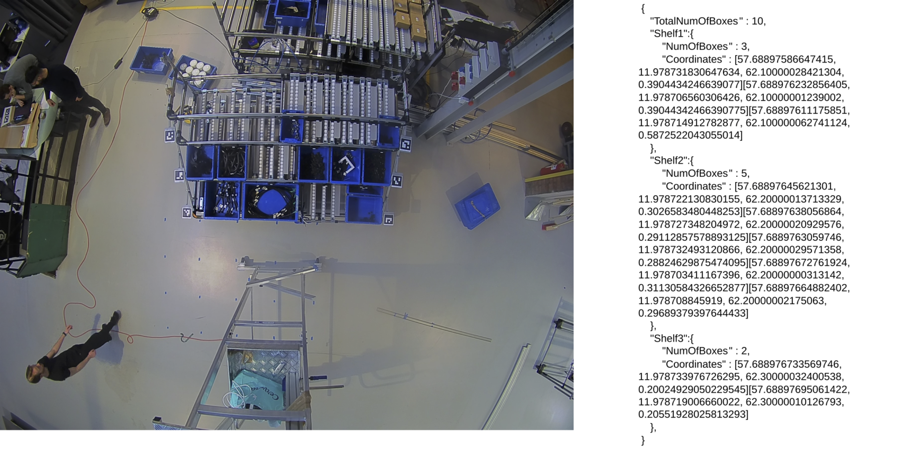

# Machine learning to detect the position of storage bins (Chalmers Bachelor Thesis EENX15-21-19 )

Github for the bachelor thesis _Machine learning to detect the position of storage bins_[(pdf)](https://github.com/gurrajo/markerlib/raw/master/EENX15_21_19_Storagebins_final.pdf) at Chalmers done by Ismail Gülec, Gustav Onbeck, Marcus Berg, Khalid Barkhad, Iman Shahmari and Alexander Bodin. The goal of the thesis was to develope a model for detection of storage bins at Volvo. Special thanks to our supervisors, Knut Åkesson from Chalmers and Jacques Roubaud from Volvo, for helping us throughout the course of the thesis.

### Image above shows the input and output of the system, the input (to the left) is a image of storage bins with Aruco 4x4 markers and the output (to the right) shows the coordinates of each box in the WGS84 system

## main.py

Runs the detection model for one picture, prints out the results and sends a json file to the redis server.
**NOTE : Sending to redis server not initialized: go to markerlib.redis_send(), remove the comment and change server adress**

# Report

The report can be found here: [Download](https://github.com/gurrajo/markerlib/raw/master/EENX15_21_19_Storagebins_final.pdf)

# Contributors

Ismail Gülec
Gustav Onbeck
Marcus Berg
Khalid Barkhad
Iman Shahmari
Alexander Bodin [(LinkedIn)](https://www.linkedin.com/in/alex-bodin)
